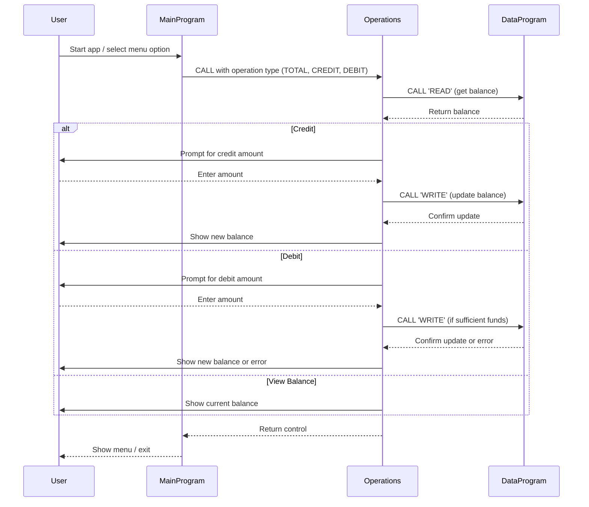

# Week4Lab COBOL Student Account System Documentation

This project is a simple COBOL-based student account management system. It demonstrates basic procedural programming, modularization, and file-based data handling in COBOL. The system allows users to view, credit, and debit a student account balance via a text-based menu.

## COBOL Source Files Overview

### 1. `main.cob`
**Purpose:**
- Acts as the main entry point and user interface for the account management system.
- Presents a menu to the user for viewing balance, crediting, debiting, or exiting.
- Handles user input and delegates operations to the `operations.cob` module via COBOL `CALL` statements.

**Key Logic:**
- Loops until the user chooses to exit.
- Validates user input (choices 1-4).
- Calls the `Operations` program with the appropriate operation type (`TOTAL`, `CREDIT`, `DEBIT`).

### 2. `operations.cob`
**Purpose:**
- Implements the core business logic for account operations.
- Handles credit, debit, and balance inquiry requests.
- Interacts with the data storage module (`data.cob`) to read and update the account balance.

**Key Functions:**
- Receives an operation type via the linkage section (`TOTAL`, `CREDIT`, `DEBIT`).
- For `CREDIT`: Prompts for an amount, reads the current balance, adds the amount, writes the new balance, and displays the result.
- For `DEBIT`: Prompts for an amount, checks if sufficient funds exist, subtracts the amount if possible, writes the new balance, and displays the result. If insufficient funds, displays an error.
- For `TOTAL`: Reads and displays the current balance.

**Business Rules:**
- Debit operations are only allowed if the account has sufficient funds.
- All balance updates are persisted via the data module.

### 3. `data.cob`
**Purpose:**
- Acts as a simple data storage handler for the account balance.
- Provides read and write access to the balance for other modules.

**Key Functions:**
- Receives an operation type (`READ` or `WRITE`) and a balance value via the linkage section.
- For `READ`: Returns the current stored balance.
- For `WRITE`: Updates the stored balance with the provided value.

**Business Rules:**
- The balance is initialized to 1000.00 by default.
- Only the `Operations` module should interact with this data handler.

## Business Rules Summary
- **Account balance cannot go negative.** Debit is denied if funds are insufficient.
- **All operations are menu-driven and require user confirmation.**
- **Initial balance is set to 1000.00.**

---

For further details, see the source code in `/src/cobol/`.

---

## Sequence Diagram: Data Flow

